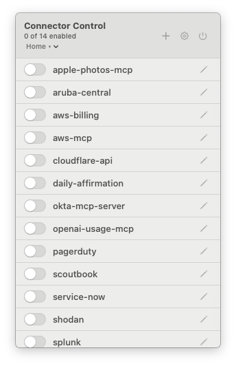
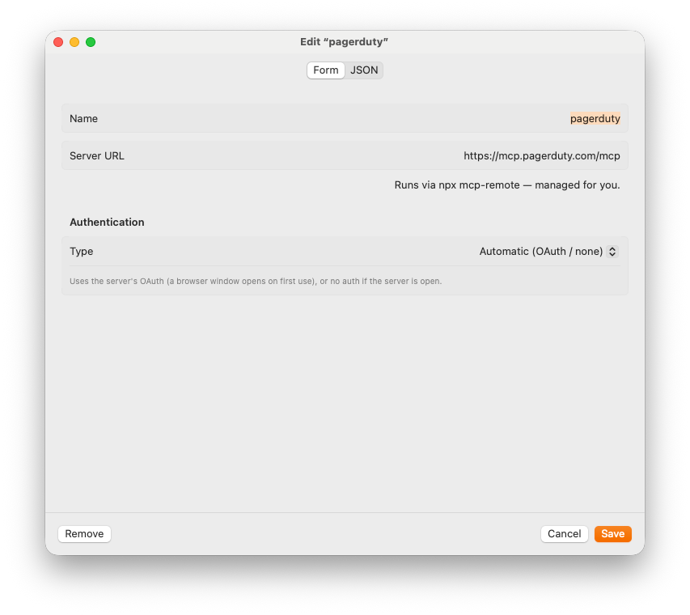
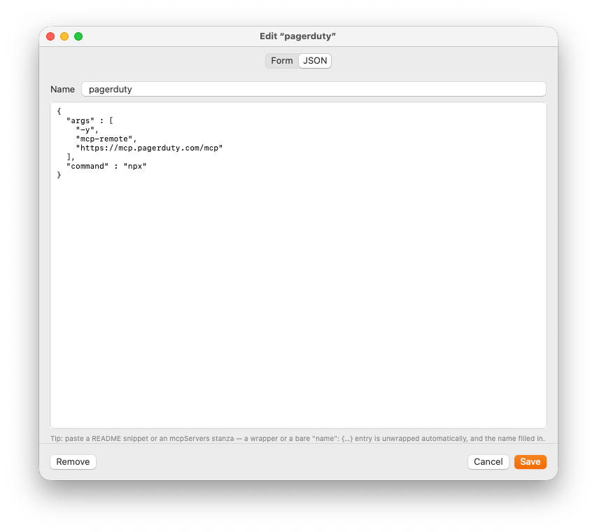
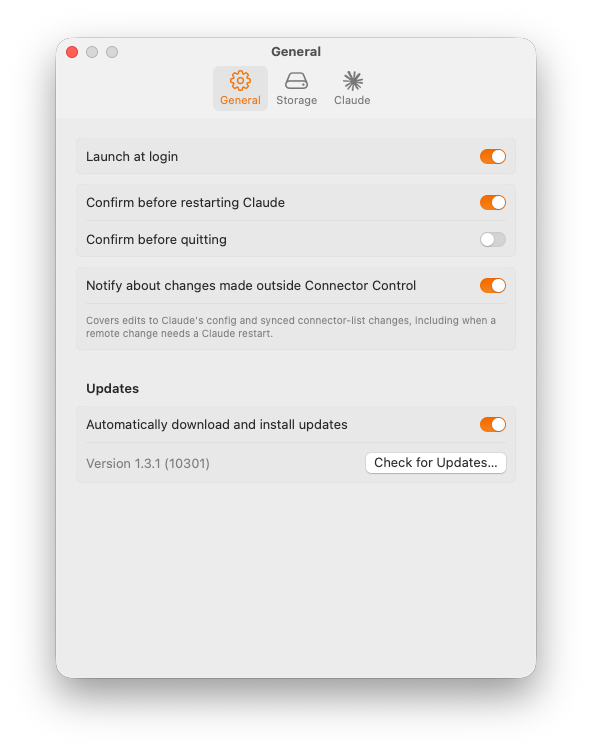
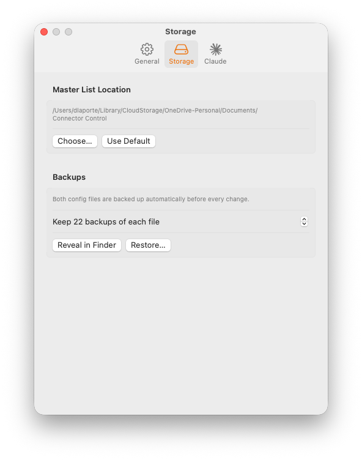
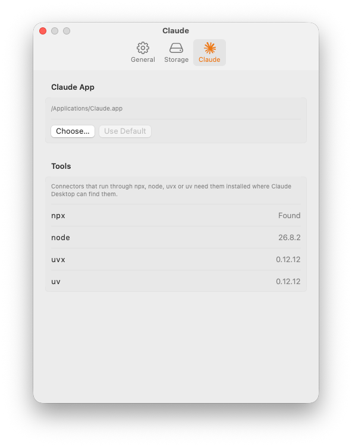

# Connector Control

Native menu bar (macOS) and system tray (Windows) apps for managing the
custom MCP connectors in Claude Desktop's configuration — with automatic
backups of every change they make.

Claude Desktop reads its MCP servers from claude_desktop_config.json
(`~/Library/Application Support/Claude/` on a Mac, `%APPDATA%\Claude\` on
Windows), a file you otherwise maintain by hand and that Claude itself has
been known to overwrite or wipe
([#32345](https://github.com/anthropics/claude-code/issues/32345),
[#56296](https://github.com/anthropics/claude-code/issues/56296),
[#37286](https://github.com/anthropics/claude-code/issues/37286)). Connector
Control keeps its own **master list** as the source of truth, treats Claude's
config as generated output, and backs up both files before every write — so a
wiped or mangled config is always one click from restored.

<p align="center">
  
</p>

## Features

- **One-click enable/disable** — toggle any connector from the menu bar or
  tray; changes apply to Claude's config immediately, and a **Restart
  Required** button appears until Claude is running the new config (derived
  from Claude's actual process launch time, so it clears no matter how Claude
  restarts).
- **Full editor** — form view for the common cases (remote `mcp-remote`
  servers get a simple Name + URL form; local servers get command/args/env
  editors with secret masking), plus a raw JSON view with live validation and
  paste-a-README-snippet support. The two views stay in sync, and switching
  never silently loses fields the form can't represent.
- **Self-healing** — the app watches Claude's config; if connectors vanish
  from it (Claude update, cloud sync, crash), a banner offers one-click
  restore from the master list, and a notification fires even when the
  app's window is closed.
- **Automatic backups** — timestamped copies of both files before every
  write (configurable retention, plus a permanent first-run snapshot), with
  in-app restore.
- **Syncable** — point the master list at a folder synced by git, iCloud, or
  Dropbox and share one connector catalog across machines; backups always
  stay machine-local so they never pollute the synced folder.
- **Missing-tool warnings** — a connector that starts through npx, node,
  uvx or uv shows a caution glyph when that tool isn't installed where
  Claude Desktop can find it; the editor and Settings ▸ Claude ▸ Tools say
  what to install, with a download link and the brew or winget command.
- **Careful with secrets** — connector env vars can hold API tokens, so the
  master list and all backups are written owner-only (mode 600 on macOS, an
  owner-only ACL on Windows).

The editor's two views of the same connector:

<table>
  <tr>
    <td align="center"><br><sub>Form view</sub></td>
    <td align="center"><br><sub>JSON view</sub></td>
  </tr>
</table>

### Profiles

Profiles are full, independent connector snapshots — each has its own
complete list of connectors and enabled flags. A chip in the header of the
popover (Mac) or flyout (Windows) (`<profile name> ▾`) shows the active profile and opens a menu to switch
profiles, or to create, rename, or delete one. Switching applies immediately,
same as any other change, and raises **Restart Required** just like a toggle
would. New profiles start as a copy of the active profile's connectors.

The master list file (mcps.json) is v2 (profile-aware); older files from a
pre-Profiles build are simply rebuilt from Claude's current config the same
way any corrupted file is (see Building from source). **If you sync
mcps.json across machines, every machine must run a Profiles-capable
version** — an older app can't parse the v2 file and will treat it as
corrupt.

## Installation

### macOS

Requires macOS 14 (Sonoma) or later. The app is a universal binary
(Apple Silicon + Intel), Developer ID–signed and notarized by Apple, so it
runs without Gatekeeper warnings.

1. Download `ConnectorControl_<version>.dmg` from the
   [latest release](https://github.com/dlaporte/connector-control/releases/latest).
2. Open it and drag **Connector Control** to Applications.
3. Launch it — a plug icon appears in the menu bar. On first run it imports
   your existing connectors from Claude's config into the master list and
   takes a permanent snapshot of your original config.

There is no dock icon; the app lives entirely in the menu bar. Enable
**Launch at login** in Settings (⚙︎) if you want it always available. The
app checks for new releases on its own and offers each one in an update
window; Settings ▸ General ▸ Updates has a switch for installing them
automatically instead, and a **Check for Updates…** button.

#### Uninstalling

Quit the app, then remove:

    /Applications/Connector Control.app
    ~/Library/Application Support/Connector Control/   # master list + backups

Your claude_desktop_config.json keeps whatever connectors were enabled at
the time — the app leaves Claude's config valid on the way out.

### Windows

Requires Windows 10 version 1809 (build 17763) or later, or Windows 11, on
an x64 or Arm64 PC. The installer and the app are code-signed. While the
publisher is new to Microsoft's SmartScreen, Windows may still show
"Windows protected your PC" with the publisher named; choose **More info**,
then **Run anyway**. The warning goes away as the signature earns reputation.

1. Download `ConnectorControl-win-x64-Setup.exe` (Intel and AMD PCs) or
   `ConnectorControl-win-arm64-Setup.exe` (Arm PCs) from the
   [latest release](https://github.com/dlaporte/connector-control/releases/latest).
2. Run it. It installs for the current user — no administrator prompt —
   under `%LOCALAPPDATA%\ConnectorControl`, adds a Start menu entry (no
   desktop icon), and launches the app.
3. A plug icon appears in the system tray; open the `^` overflow if Windows
   tucked it away there. On first run the app imports your existing
   connectors from Claude's config into the master list; your first change
   takes the permanent snapshot of the original config.

Left-click the tray icon for the connector list; right-click it for
**Settings…** and **Quit**. Updates are offered, not installed silently: the
app checks GitHub for new releases and shows **Install and Relaunch** when
one is available (Settings ▸ General ▸ Updates has a switch to download and
install them automatically, and a **Check for Updates…** button). Turn on
**Launch at startup** there to have it always available.

#### Uninstalling

Settings ▸ Apps ▸ Installed apps ▸ Connector Control ▸ Uninstall removes
the program (`%LOCALAPPDATA%\ConnectorControl`). App data is left in place;
delete it yourself for a clean slate:

    %LOCALAPPDATA%\Connector Control\    # master list, backups, settings

Your claude_desktop_config.json keeps whatever connectors were enabled at
the time — the app leaves Claude's config valid on the way out.

## How it works

```
~/Library/Application Support/Connector Control/
├── mcps.json          ← master list: every connector + enabled flag (source of truth)
└── backups/           ← timestamped copies of both files, rotated; machine-local
    └── claude_desktop_config.original.json   ← first-run snapshot, never pruned

~/Library/Application Support/Claude/claude_desktop_config.json
                       ← generated output: only enabled connectors are written;
                         every other key in the file is preserved untouched
```

On Windows the same layout lives under `%LOCALAPPDATA%` (never the roaming
profile, so backups stay on the machine that made them):

```
%LOCALAPPDATA%\Connector Control\
├── mcps.json          ← master list (source of truth)
├── settings.json      ← app settings
└── backups\           ← timestamped copies of both files, rotated; machine-local
    └── claude_desktop_config.original.json   ← first snapshot, never pruned

%APPDATA%\Claude\claude_desktop_config.json   ← generated output, as above
```

Every change (toggle, edit, add, remove, restore) writes the master list and
regenerates the `mcpServers` section of Claude's config — atomically, after
backing both up. A reconciliation pass runs at launch, every time the popover or flyout
opens, and whenever either file changes on disk: connectors added outside the app
are imported, external edits are detected (and you're notified), and
connectors missing from Claude's config are flagged for restore rather than
ever being silently dropped. Claude only reads its config at startup, hence
the Restart Required flow.

On Windows, **Restart Claude** asks Claude Desktop to end its session cleanly
(the same request Windows sends at sign-out) and relaunches it from its Start
menu entry. Older builds of Claude Desktop kept a virtualized copy of the
config under `%LOCALAPPDATA%\Packages\Claude_…\LocalCache\Roaming\Claude\`;
the app manages that copy only when it exists, and Settings ▸ Claude lets
you point it at any file.

### Settings

<table>
  <tr>
    <td align="center"><br><sub>General</sub></td>
    <td align="center"><br><sub>Storage</sub></td>
    <td align="center"><br><sub>Claude</sub></td>
  </tr>
</table>

**General** covers launch-at-login, the confirmation prompts, outside-change
notifications, and updates. **Storage** is where the master list lives (point
it at a synced folder to share connectors across machines) and how many
backups to keep. **Claude** lets you choose which Claude app to restart and
shows whether the launchers connectors depend on are installed.

### Syncing across machines

Settings → Storage → **Master List Location** → choose a folder inside your
synced location (a git repo, iCloud Drive, OneDrive, Dropbox). The app adopts an
mcps.json already there, or seeds the folder with your current list. Other
machines running Connector Control point at the same folder and pick up
changes live (the file is watched). Notes:

- The whole file syncs — including enabled/disabled state.
- Connector env vars (API keys!) sync too. Use a private repo, or keep
  secrets out of synced connectors.
- A change that arrives through the synced folder is written into Claude's
  config and announced by name — which connectors it added, removed or
  changed — whether or not Claude is running at the time. Every connector
  is a command Claude runs, so treat write access to the synced folder as
  you would treat access to the machines that follow it.
- Conflicts are your sync tool's department; local backups make any bad
  merge recoverable.
- A Mac and a PC can share one list, but connector commands are OS-specific:
  a Mac writes remote connectors as `npx mcp-remote …`, Windows writes them
  as `cmd /c npx mcp-remote …`, and local servers carry their own paths.
  Each app preserves the other platform's entries untouched — an entry may
  simply fail to start in Claude on the other OS until you edit it there.
  Because cmd.exe re-parses everything after `cmd /c`, the Windows editor
  refuses a URL, header name or OAuth client field containing `& | < > ^ "`
  or a space for such a connector; use the JSON view if you really need one.

## Building from source

### macOS

Requires Xcode 15.4+ (Swift 5.10). Command Line Tools alone can compile the
app but cannot run the test suite.

    git clone https://github.com/dlaporte/connector-control.git
    cd connector-control
    swift test                # 304 tests, no network, never touches your real config
    ./scripts/build-app.sh    # → build/Connector Control.app (ad-hoc signed)
    cp -R "build/Connector Control.app" /Applications/

For development against a throwaway config instead of your real one:

    mkdir -p .sandbox/store
    cp "$HOME/Library/Application Support/Claude/claude_desktop_config.json" .sandbox/
    CONNECTOR_CONTROL_CLAUDE_CONFIG="$PWD/.sandbox/claude_desktop_config.json" \
    CONNECTOR_CONTROL_STORE_DIR="$PWD/.sandbox/store" \
    swift run ConnectorControl

### Windows

Requires the .NET SDK 10.0.400 or a later 10.0.x (`windows/global.json`).
The solution also builds — but the app cannot run — on a Mac or Linux with
the same SDK, which is how the shared Core tests run on both.

    dotnet test windows/ConnectorControl.slnx          # Core + app tests, no network
    dotnet run --project windows/src/ConnectorControl.App

The same `CONNECTOR_CONTROL_CLAUDE_CONFIG` and `CONNECTOR_CONTROL_STORE_DIR`
overrides point a development run at a throwaway config. Installers are
built by `windows/scripts/package.ps1` (Velopack, `vpk` 1.2.0), which is
also what the in-app updater consumes.

Releases are produced by [`.github/workflows/release.yml`](.github/workflows/release.yml)
on version tags — both platforms from one tag, onto one GitHub release: the
universal Mac build, Developer ID signing with hardened runtime, Apple
notarization of both the app and the DMG, stapling, and the Sparkle
appcast; and the Windows installers for x64 and Arm64, code-signed with
Azure Artifact Signing and checked by a silent install on a Windows runner.
Windows preview builds for testers (GitHub prereleases, which never touch
the Mac update feed) come from
[`windows-preview.yml`](.github/workflows/windows-preview.yml), started
either by a `windows-preview-<n>` tag or by hand from the Actions tab
(Run workflow, with the preview number; a dry run by default). All three
Windows workflows share one build definition,
[`windows-build.yml`](.github/workflows/windows-build.yml).

## Scope and caveats

- Manages the `mcpServers` section of Claude **Desktop**'s config only — not
  claude.ai web connectors, Claude Desktop extensions, or Claude Code's MCP
  configuration.
- Neither app is sandboxed: each needs to read and write Claude Desktop's
  config file and to quit and relaunch Claude.
- Restarting Claude interrupts any in-progress conversation; the app asks
  first by default (Settings → General).
- Windows: Claude Desktop is found by its app package (`Claude_pzs8sxrjxfjjc`)
  or, for older installs, its program folder; if Claude does not come back
  after a restart the app says so rather than guessing.

## License

[MIT](LICENSE) — © 2026 David LaPorte
